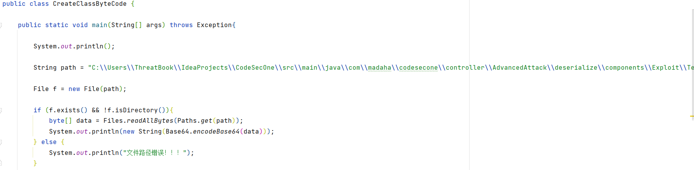
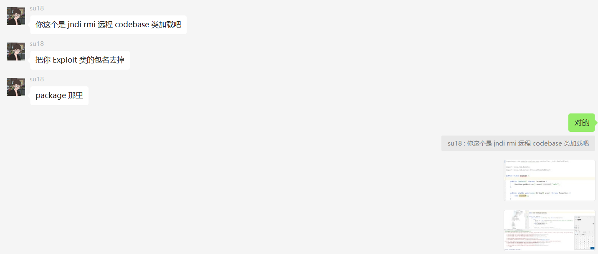

# 防止报错

出于 防止出错，我将 package 直接去掉！

然后 再构造恶意恶意类。

# 构造poc

使用java代码读取class文件，并将其base64编码，用于fastjson的TemplatesImpl利用链。

# 问题解决：

jdk8换了好低版本，能够进行jndi注入。

但是，不知道什么原因，只要远程加载就报错。 啊啊啊~~

找到问题了，最终还是请教的su18师傅，原来是Package不能加。

大佬就是大佬，一上手就知道有没有。