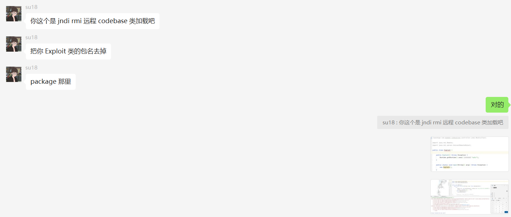
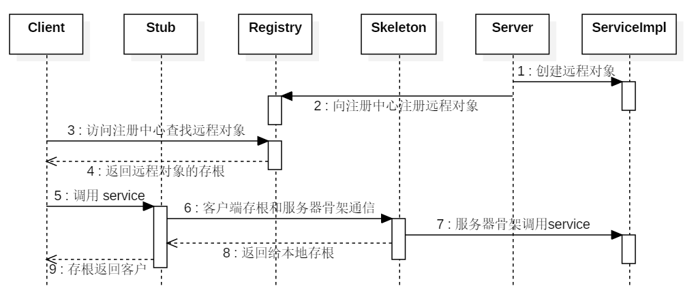

# 问题：

jdk8换了好低版本，能够进行jndi注入。

但是，不知道什么原因，只要远程加载就包错。 啊啊啊~~

找到问题了，最终还是请教的su18师傅，原来是Package不能加。

大佬就是大佬，一上手就知道有没有。

# 其他：关于rmi反序列化攻击，直接看su18师傅的文章
https://su18.org/post/rmi-attack/

RMI (Remote Method Invocation) 远程方法调用，顾名思义，是一种调用远程位置的对象来执行方法的思想。

这种思想在 C 语言中的 RPC（Remote Procedure Calls）中早就有了体现，但是 RPC 是打包和传送数据结构，而在 Java 中，我们通常传递一个完整的对象，这个对象既包含数据，也包含数据和操作数据的方法，Java 中如果想完整的在网络中向远程位置传输一个对象，我们通常使用的方法是 Java 原生反序列化，并且可以结合动态类加载和安全管理器来安全的传输一个 Java 类。

而具体的实现思想就是让我们获取远程主机上对象的引用，我们调用这个引用对象，但实际方法的执行在远程位置上。

为了屏蔽网络通信的复杂性，RMI 引入了两个概念，分别是 Stubs（客户端存根） 以及 Skeletons（服务端骨架），当客户端（Client）试图调用一个在远端的 Object 时，实际调用的是客户端本地的一个代理类（Proxy），这个代理类就称为 Stub，而在调用远端（Server）的目标类之前，也会经过一个对应的远端代理类，就是 Skeleton，它从 Stub 中接收远程方法调用并传递给真实的目标类。Stubs 以及 Skeletons 的调用对于 RMI 服务的使用者来讲是隐藏的，我们无需主动的去调用相关的方法。但实际的客户端和服务端的网络通信时通过 Stub 和 Skeleton 来实现的。

这里先简单列一下整体调用时序图：
