# yaml RCE 测试

## 使用工具生成恶意的 jar 包

使用 https://github.com/artsploit/yaml-payload 生成 palyload。
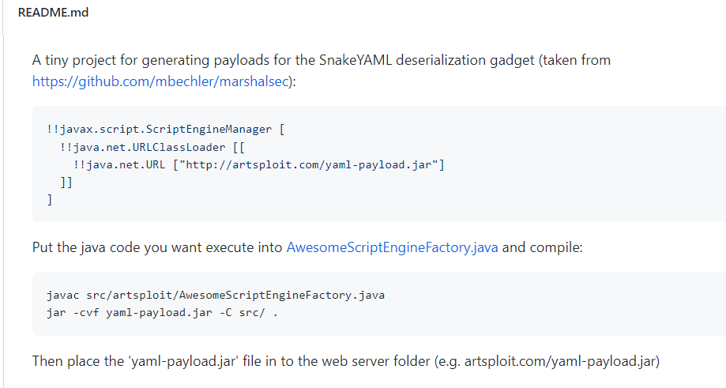


将要执行的“命令/代码”放到 AwesomeScriptEngineFactory 下：
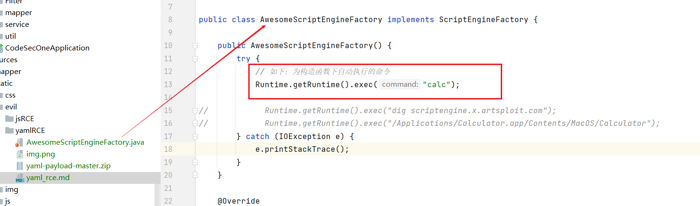
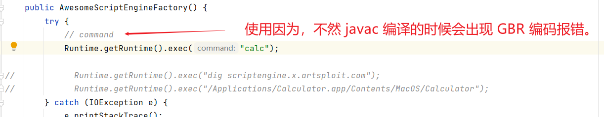


然后使用 javac 进行编译：
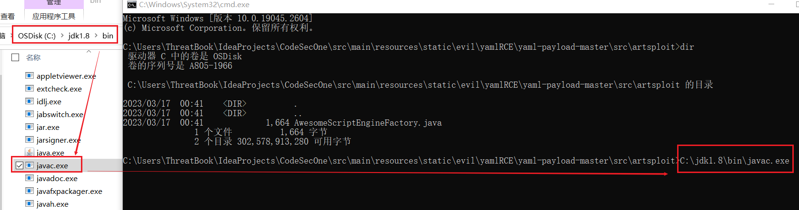
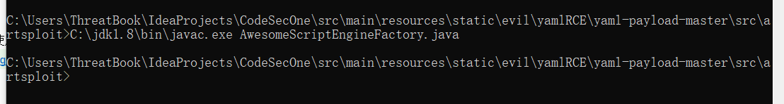


上一步执行过后会生成 class 文件：
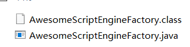


然后再使用 jar 打包命令，打包成jar文件：

``` jar -cvf yaml-payload.jar -C src/ .```

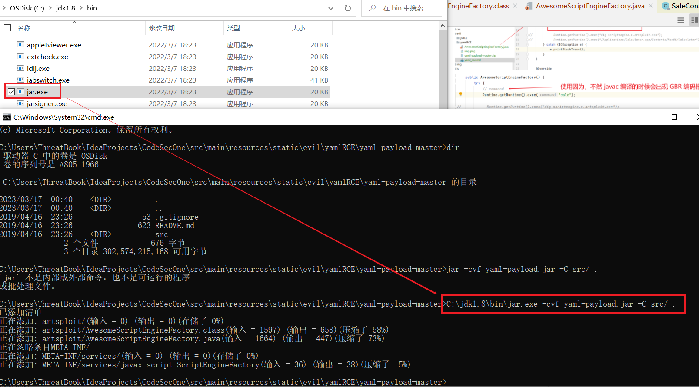
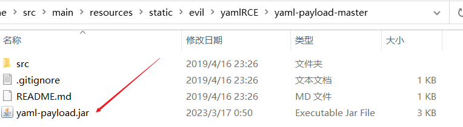


## 执行攻击

使用 python 起一个 web 服务
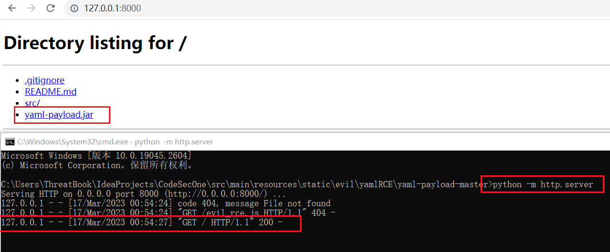


发起请求：但就命令执行不成功， giaogiao


按道理说 这里 yaml 对象也创建出来了，但是为啥就是不谈 shell ，我不理解。  
啊 ~~~~ ，哪位师傅 指点指点 我。。。
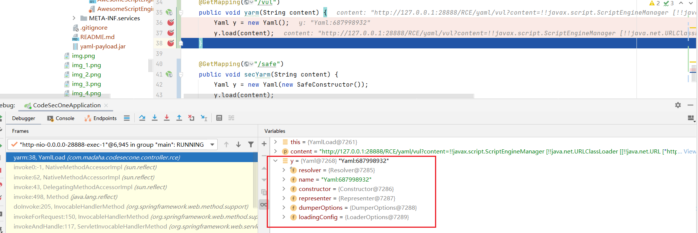


woc，这大晚上的左思右想睡不着，拿起手机到github上看一下吧，原来问题出在这里了
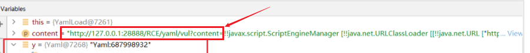


我哭了！giaogiao，怎还弹不出来。
ccc，原来是python起的web服务目录错了。。。


tnnd，终于弹出来了。
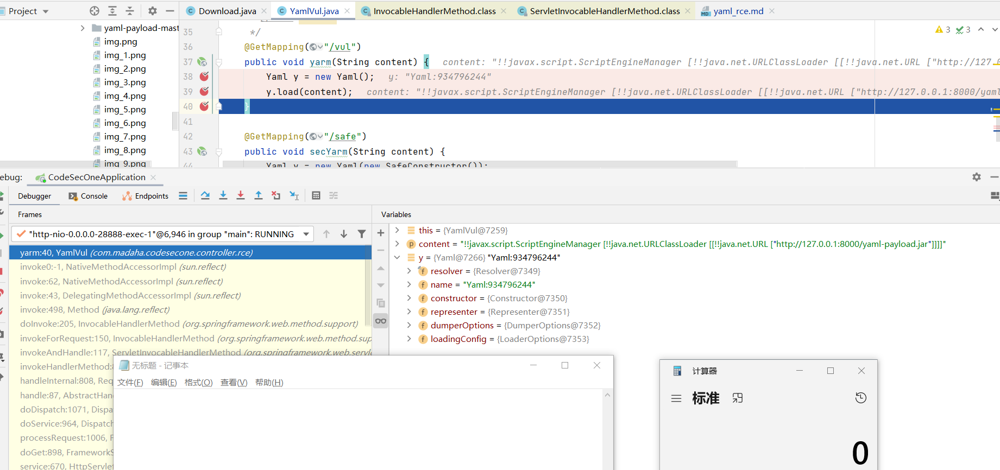


话不多说，2点了。睡觉睡觉。。


